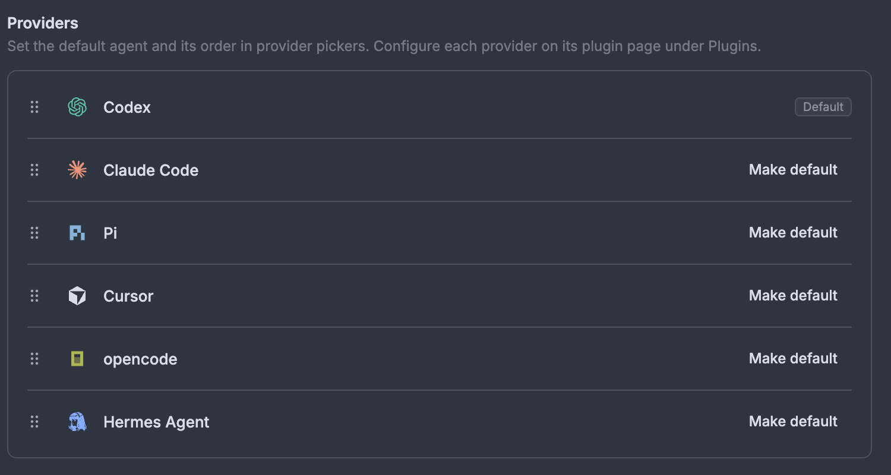

# Provider Brand Marks

bb draws every provider logo as a monochrome mask that follows your theme, so
Codex, Claude Code, Pi and Hermes all end up the same colour. This plugin gives
each one its own brand colour instead — without touching your palette.

It is additive: keep Nord, Dracula, Tokyo Night or your own custom theme, and
the marks adapt to it.



## Install

```sh
bb plugin install git:https://github.com/ChrBoebel/bb-plugin-provider-brand-marks.git@^0.1.0
```

## How the colours are chosen

Each mark starts from the vendor's published brand colour and is fitted to the
active palette in CSS, per repaint:

```css
oklch(from var(--pbm-brand-codex) var(--pbm-lightness)
      min(calc(c * var(--pbm-chroma-scale)), var(--pbm-chroma-cap)) h)
```

- **Hue is never touched** — that is what makes a brand recognisable.
- **Chroma** is scaled to `0.85` and capped at `0.125`. bb's palettes are muted
  (Nord's most saturated accent sits at chroma `0.121`), so a loud brand like
  Hermes' `#0000F2` (chroma `0.301`) would otherwise scream.
- **Lightness** is pinned to `0.60` on light backgrounds and `0.75` on dark
  ones, which clears WCAG's 3:1 non-text contrast bar on every bundled palette.

| Provider | Brand colour | Source |
| --- | --- | --- |
| Claude Code | `#D97757` | Anthropic's signature accent |
| Codex | `#10A37F` | OpenAI green — their palette is otherwise black and white |
| Pi | `#6A9FCC` | `--accent` in the stylesheet on [pi.dev](https://pi.dev) |
| Hermes Agent | `#0000F2` | `theme-color` / `bg-hermes` on [hermes-agent.nousresearch.com](https://hermes-agent.nousresearch.com) |
| opencode | `#B8C425` | **weakly sourced** — approximated from the chartreuse interactive token on [opencode.ai](https://opencode.ai); their docs site otherwise uses a generic template blue. Corrections welcome. |
| Cursor | — | deliberately monochrome; tracks your palette's `--foreground` |

Providers not in that table are left exactly as bb draws them. Every colour except
opencode's comes from a value the vendor publishes; see the note in that row.

## Overriding anything

Every value is a CSS custom property, so your own theme wins. Recolour one
provider, or retune the whole thing:

```css
/* in <bb-data-dir>/theme/<your-theme>/theme.css */
:root {
  --pbm-brand-codex: #1a7f64;  /* a different green */
  --pbm-chroma-scale: 1;       /* no muting — the raw brand colour */
  --pbm-lightness: 0.55;       /* darker marks in light mode */
}
.dark {
  --pbm-lightness: 0.8;
}
```

## Companion plugins

Two popular usage plugins draw provider marks themselves rather than using bb's
logo mask, so this plugin points their colour variables at the same values:

- [`bb-usage-page`](https://github.com/iamEvanYT/bb-usage-page) — one variable
  per provider drives both the mark **and** that provider's chart series, so
  the daily-cost lines are recoloured to match.
- [`usage-tracker`](https://github.com/MateoCerquetella/bb-plugins) — the
  compact strip in the sidebar footer.

Those rules do nothing if you do not have the plugins installed.

## Caveats

`data-provider-logo` and `data-provider-icon-tint` are internal bb DOM details,
not a public API. A future bb release could rename them, in which case the
stylesheet simply stops matching and you get bb's stock colours back — the
plugin has no other effect. The mark itself is a single-colour mask, so
gradient or multi-colour logos are not possible.

This is a frontend content script: full-trust, same-origin page code, like every
bb plugin with a `bb.app` entry.

## Development

```sh
npm install
bb plugin install .
bb plugin dev      # rebuild + reload on save
```

`npm run build` shells out to `bb plugin build`, so it needs the `bb` CLI on
your `PATH`. You do not need it to *use* the plugin — bb builds git and path
installs itself.

## License

MIT
